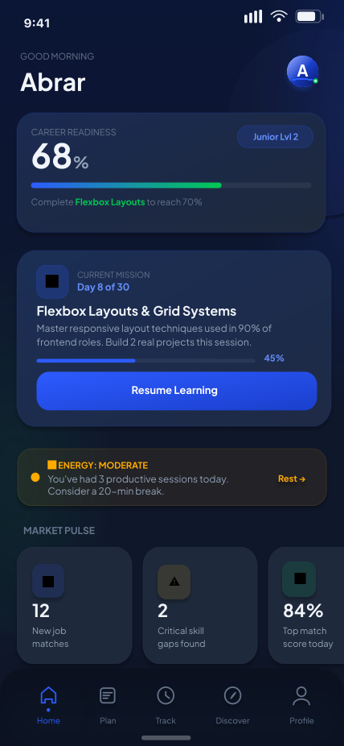

# Sanad-UX-Case-Study
# Sanad: Smart Guide. Steady Path. 

A digital solution providing a steady path through smart guidance. Built with a focus on UI/UX psychology, design systems, and seamless frontend performance.
> A comprehensive UX Case Study and interactive platform designed to guide users with clarity and stability.

[Link to Live Website](https://Abrarayman27.github.io/Sanad-UX-Case-Study/) | [View Figma Prototype](https://www.figma.com/proto/iR7WOBUkGcHcLTuXDj5NNL/Sanad?node-id=25-466&p=f&t=6OYJxPE8Z2pZ9O3Q-1&scaling=scale-down&content-scaling=fixed&page-id=0%3A1&starting-point-node-id=39%3A2310)

---
##  Introduction
Sanad (Arabic for "Support/Prop") is more than a design concept—it is a functional study in building trust through interface. This project showcases a full end-to-end workflow, transitioning from high-fidelity Figma prototypes with complex micro-interactions to a clean, performance-optimized codebase.

## 📖 Project Overview
Sanad is a digital solution focused on providing a "steady path" for its users. This project explores the intersection of user psychology, interactive narratives, and minimalist design systems.

### Key Features
- **15+ Interactive Screens:** Fully realized UI with complex transitions.
- **Micro-interactions:** Custom-coded CSS/JS animations for a premium feel.
- **Design System:** Built using Figma tokens for scalability and consistency.

## 🛠️ Technical Stack
- **Frontend:** HTML5, CSS3 (Custom Variables), JavaScript (ES6)
- **Design Tooling:** Figma (Advanced Prototyping, Auto-layout 5.0)
- **Methodology:** Atomic Design, User-Centered Design (UCD)

## 🎨 Visual Identity
The visual language of Sanad follows a **Focused Clarity** principle—modern, minimalist, and accessible.

## Highlights
Design Logic: Rooted in the "Focused Clarity" principle to reduce cognitive load.
Engineering: Developed with clean, semantic HTML and modular CSS to ensure accessibility and scalability.
User Experience: Features 15+ interactive screens that demonstrate a deep understanding of user flow and psychological triggers.

<!-- You can add a screenshot or GIF of the app here -->

## 🚀 How to Run Locally
1. Clone the repo: `git clone https://github.com/Abrarayman27/Sanad-UX-Case-Study.git`
2. Open `index.html` in your browser.
